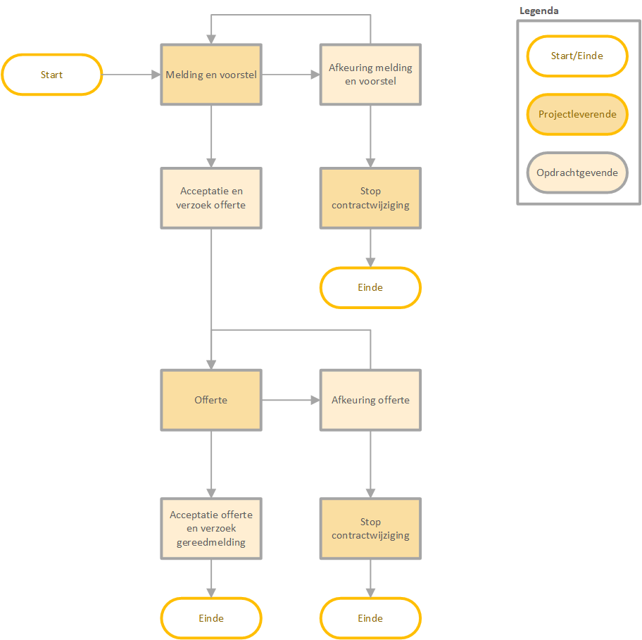
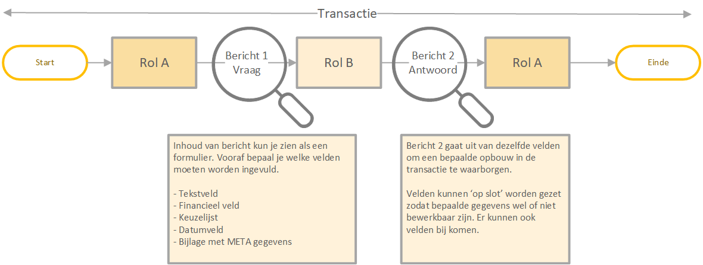
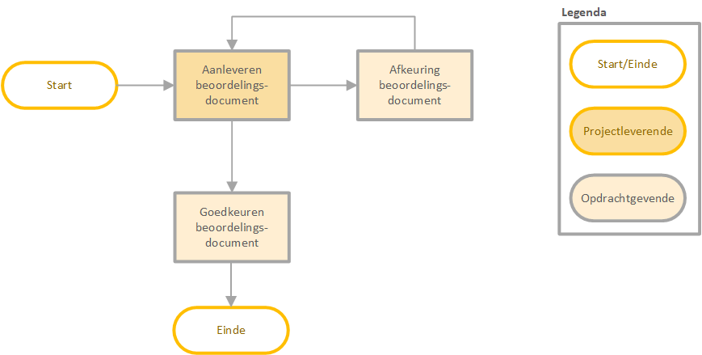
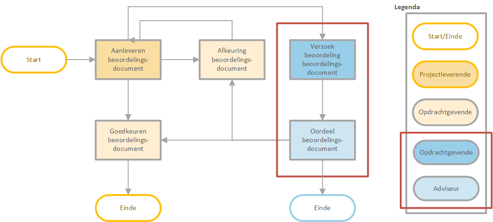

# Conceptueel

## Werking voor een gebruiker

Voor een gebruiker van een VISI-applicatie voelt VISI als een berichtenbox of takenmanager, waarin precies zichtbaar is welke berichten nog moeten worden beantwoord, welke antwoorden kunnen worden verwacht en welke deadlines er afgesproken zijn.

### Uitvoering

***Berichten versturen en afspraken nakomen***  

**VISI helpt bij het nakomen van afspraken.** Een gebruiker weet altijd welke acties hij/zij, of de ander, nog moet uitvoeren. Tijdens de uitvoering kan de gebruiker, indien de gebruiker de juiste rol heeft, een berichtenstroom opstarten om een specifieke transactie uit te voeren. De gebruikers kan zien welke antwoorden gegeven kunnen worden, en welke berichten nog kunnen worden verwachten.   

**Het is duidelijk of een bericht aangekomen is.** Door de afspraken over het berichtenverkeer, weet een gebruiker zeker dat een bericht is aangekomen.  

**Overdracht van werk aan een nieuwe medewerker gaat naadloos.** Omdat een medewerker een rol heeft, kan tijdens een samenwerking een opvolger worden aangewezen. Vanaf dat moment neemt deze opvolger de berichtenstroom over. Van een VISI applicatie wordt verwacht dat de opvolger ook de berichten van de voorganger ter beschikking heeft.

**De communicatie is terug te vinden voor alle betrokkenen, zonder wederzijdse afhankelijkheid.** Indien meerdere organisaties samenwerken, kunnen zij elk gebruik maken van hun eigen VISI software. Door de afspraken over het berichtenverkeer hebben twee personen in een verschillende organisatie beiden in hun eigen VISI software de beschikking over het berichtenverkeer binnen de eigen organisatie en het berichtenverkeer op het raakvlak van de andere organisatie.   

**Met VISI zijn wijzigingen in de samenwerkafspraken altijd traceerbaar.** Tijdens het project kunnen de afspraken over de workflow, berichtinhoud, rollen en verantwoordelijkheden gewijzigd worden.  

### Voorbereiding

***Flexibiliteit van VISI in het maken van samenwerkafspraken***
  
  **Door van te voren afspraken te maken over taken en verantwoordelijkheden weet men van elkaar waar men aan toe is.** Bij de voorbereiding van de samenwerking wordt afgesproken wie welke rol heeft, en welke taken deze rol heeft.
  
  **Door van te voren afspraken te maken over de communicatie weet iedereen van elkaar waar men aan toe is.** Bij de voorbereiding van de samenwerking wordt bepaald welke rollen met elkaar communiceren over taken, en welke berichtenflow hier bij hoort. Door van te voren afspraken te maken over de informatie die van elkaar verwacht wordt, weten betrokkenen van elkaar wat verwacht mag worden. Bij de voorbereiding van de samenwerking wordt bij elk bericht bepaald welke inhoud het bericht heeft, inclusief bijlagen.
  
  **Partijen hebben de vrijheid om de samenwerking vorm te geven zoals is gewenst.** VISI is zeer flexibel: Partijen zijn vrij om de samenwerking vorm te geven zoals de betrokkenen wensen, VISI standaardiseert de manier waarop je rollen, workflows en berichten digitaal vastlegt. Dit vraagt van softwarepakketten, dat zij voorbereid  zijn om deze flexibele afspraken per project of samenwerking te kunnen inlezen  en activeren, waardoor de communicatie op basis van VISI kan worden gestart. 

## VISI brengt structuur aan

Om de uitwisseling van informatie gestructureerd te laten verlopen zijn binnen VISI digitale communicatieafspraken vastgelegd. Het gebruiksgemak is vergelijkbaar met bijvoorbeeld het versturen van e-mails of het aanbieden van documenten op een gedeelde Sharepoint omgeving. Het verschil is dat de inhoud van de berichten vooraf zijn gedefinieerd. Zo bevat een bericht invulbare velden zoals een formulier. Aan de berichten kan de verzender bijlagen toevoegen. Het is na afloop van een project nog steeds duidelijk op basis van welke versie van een bijlage/bestand een bepaald oordeel op basis van een bericht is gegeven.

Van te voren wordt ook nagedacht wie vanuit welke verantwoordelijkheid met elkaar communiceert. Dit wordt uitgedrukt in zogenaamde rollen. 

Tussen die rollen vinden workflows plaats om een bepaald resultaat te behalen. Hiervoor gebruiken we de term 'transactie'. Dit leggen we allemaal vast in een structuur die het VISI-raamwerk wordt genoemd. Zo hoeft de gebruiker tijdens de uitvoeringsfase niet meer na te denken welke stappen en mogelijkheden er zijn binnen bepaalde procesafspraken, maar kunnen de projectdeelnemers zich focussen op de inhoud van de communicatie.

### Voorbeelden als een project d.m.v. VISI zou worden ingericht

<aside class="example" title="Bouwproject">

 De interactie start in dit voorbeeld bij de Opdrachtnemer (projectleverende). De Opdrachtgever kan het voorstel afkeuren of goedkeuren met verzoek om een offerte. Als de Opdrachtnemer een afkeuring ontvangt dan wordt het proces om een contractwijziging vast te leggen beëindigd. Als het voorstel wel wordt goedgekeurd dan levert de Opdrachtnemer een offerte met consequenties van de contractwijziging. Hierka kan de Opdrachtgever opnieuw een afkeuring of acceptatie versturen waarna de contractwijziging wordt stopgezet cq. geaccepteerd.

 
</aside>

<aside class="example" title="Pizzeria"> 

 De interactie start in dit voorbeeld bij de Ober. De Klant heeft een beperkt aantal reactiemogelijkheden. Als de Klant geen menukaart wenst te zien dan stopt de interactie. Als de Klant wel een menukaart wil zien dan gaat de transactie verder. De scope van deze transactie is het plaatsen van een bestelling. Een andere transactie zou bijvoorbeeld zijn dat de Klant vraagt om de rekening aan de Ober waarna de Ober de rekening brengt. 

</aside>

<aside class="example" title="Pizzeria"> 

 De Ober plaatst de bestelling bij de Kok. De Kok kan de bestelling accepteren óf weigeren. Afhankelijk van de reactie van de Kok wordt een reactie gegeven aan de Klant. Bijvoorbeeld een vraag over bestelling. Het wordt dusdanig gestructureerd dat de Klant niet direct met de Kok kan communiceren. 

</aside>

## Termen uit de VISI systematiek

### Rol

Binnen (bouw)projecten en samenwerkingsvormen komen verschillende verantwoordelijkheden en hierbij behorende taken voor. Denk hierbij aan een simpele overeenkomst met een Opdrachtnemer en Opdrachtgever met overeengekomen taken en verantwoordelijkheden. Deze verantwoordelijkheden met bijbehorende taken worden gebundeld in logische rollen. Het concept hoe partijen met elkaar omgaan en de overeenkomst die ze met elkaar hebben is van invloed op de verdeling van rollen over de partijen.

Een rol is fundamenteel anders dan een functie. Een essentieel verschil is dat rollen een afspiegeling zijn van het werk dat georganiseerd wordt, terwijl functies een afspiegeling zijn van mensen die georganiseerd worden (in een organisatie). Een VISI-project heeft geen functie Afdelingshoofd, maar wel de rollen Beoordelende, Adviserende.

### Bericht

Berichten zijn een middel om informatie over te dragen cq. gegevens uit te wisselen. De berichtnaam staat gelijk aan een bepaalde status, afhankelijk van de positie binnen een proces (aanleveren document, of een afkeuring). Een bericht bestaat uit verschillende velden, afhankelijk van de informatie die nodig is. Sommige onderdelen van een bericht staan vast, zoals de afzender en het tijdstip van verzenden.

**Informatie in een bericht**

De inhoud van een bericht is te vergelijken met een formulier met velden. Zoals: tekstvelden, data, bedragen, Ja/Nee, keuzelijsten, en/of tabellen.
Hier vindt overerving plaats. Ingevulde gegevens uit een voorgaand bericht worden in principe mee verstuurd in een volgend bericht, tenzij er een zogenoemde conditie is meegegeven in het raamwerk.

**Bijlagen en META-gegevens**

Aan VISI-berichten kunnen één of meerdere bijlagen worden toegevoegd. Dit komt sterk overeen met een ‘attachement’ van een e-mail. Een belangrijk verschil is echter dat een bijlage  van een VISI-bericht kan worden voorzien van META-gegevens. Deze elementen kunnen vooraf worden gedefinieerd. Denk hierbij bijvoorbeeld aan het versienummer, documentdatum, status, etcetera. Hierbij kan bijvoorbeeld rekening worden gehouden met de META-gegevens die in een organisatiespecifieke documentmanagementsysteem noodzakelijk zijn.

**Bijlagen (één of meerdere bijlagen)**

Doordat bijlagen zijn toegevoegd aan een bericht, is een bijlage achteraf altijd in context te plaatsen. Op welk moment is de bijlage verstuurd en met welke status? 
- Goedgekeurd/afgekeurd/ter kennisgeving
- Concept/definitief
- Datum/versie

**Volgordelijkheid van berichten**

De berichten zijn niet alleen invulbaar, maar de opeenvolging van de berichten is ook van te voren vastgelegd. Na ontvangt van een bericht kan men in de regel één of meerdere antwoorden kiezen. Zo ligt van te voren vast hoe de communicatie er uit ziet en ook hoe het verloop is. Of met andere woorden de werkstroom ligt vast.

### Transactie

De berichten zijn ook gegroepeerd per onderwerp en vormen zo steeds kleine procedures. Procedures, dus het onderwerp waarover men wil communiceren, zijn in het algemeen steeds los van elkaar te kiezen. In VISI noemen we zo’n procedure een transactie. Met het woord transactie wordt hier bedoeld ‘overeenkomst’ of ‘verrichting’. Een transactie kan een verzoek zijn om iets te doen of iets te leveren. Vaak op basis van vooraf gemaakte afspraken.

Binnen VISI staat de zogenoemde transactie centraal: een bindende afspraak tussen twee rollen die overeenkomen wat er moet gebeuren. Een transactie is in de praktijk een serie van berichten tussen twee rollen met als uitkomst een bepaald resultaat. 

In het raamwerk wordt vastgelegd welke volgorde van berichten kan worden gebruikt bij het communiceren over de transactie. De volgorde van berichten verloopt altijd heen en weer tussen rollen: na een bericht van rol A volgt altijd een bericht van rol B waarna rol A weer aan de beurt is, tot het einde van de transactie. 

<aside class="example" title="Bouwproject">

 Denk hierbij bijvoorbeeld aan Vraag van rol A aan rol B om iets te beoordelen. Het raamwerk geeft de berichten die hierbij kunnen worden gebruikt als antwoord. In de afbeelding gaat het hierbij om bericht X of bericht Y.  

</aside>

<aside class="example" title="Bouwproject">

 De Projectleverende dient een beoordelingsdocument, zoals is afgesproken in het contract, in. De Opdrachtgever kan het beoordelingsdocument afwijzen waarna een nieuw document wordt ingediend. Als de Opdrachtgever het beoordelingsdocument goedkeurt dan is de transactie afgehandeld.  

</aside>

<aside class="example" title="Bouwproject">

 De Projectleverende dient een beoordelingsdocument zoals is afgesproken in het contract. De Opdrachtgever wil aan één of meerdere Adviseurs vragen om het beoordelingsdocument te beoordelen. Dit noemen we een aangesloten transactie of subtransactie. Deze transactie vindt ook weer plaats tussen twee rollen (niet meer, niet minder).  

</aside>

<aside class="example" title="Pizzeria">

 Een ander voorbeeld is bijvoorbeeld het verzoek van een ober aan een kok om een bepaalde pizza te bereiden (Vraag) waarna de kok aan de gang gaat en de betreffende pizza aan de ober als gereed wordt gemeld (Antwoord X) of wordt gemeld dat de ingrediënten niet in huis zijn (Antwoord Y) waarna de transactie is afgerond. 
 </aside>

## Communiceren op basis van een VISI raamwerk

Het geheel van beschrijvingen van rollen, transacties, berichten en gegevens, die de afspraken en/of communicatie omvatten die in een project/samenwerkingsverband gebruikt kunnen en mogen worden, wordt een raamwerk genoemd. Om op basis van een VISI raamwerk te kunnen communiceren dienen een aantal zaken ingesteld te worden.  
  
***Project specifiek bericht***

Het projectspecifieke bericht plaatst het raamwerk in de context van een project. Hiermee wordt bedoeld dat in dit bestand wordt aangegeven welk specifiek project en/of contract het raamwerk representeert. Hierin wordt ook vastgesteld welke personen vanuit welke organisatie in welke rol(len) deelnemen aan het project. 

***Koppeling van personen aan rollen***

In VISI zijn verantwoordelijkheden en taken niet toegekend aan partijen of personen, maar aan “rollen”. Dit is gedaan omdat in bijvoorbeeld bouwprojecten weliswaar steeds dezelfde “rollen” voorkomen maar partijen nogal eens van rol kunnen wisselen. Denk hierbij bijvoorbeeld aan een situatie waarin een Opdrachtgever bepaalde verantwoordelijkheden en taken wil laten invullen door een ingenieursbureau of een situatie waarin een pizzeria de bezorging niet door eigen bezorgers laat doen, maar een contract afsluit met een externe partij als Deliveroo of Uber eats. Een persoon kan met behulp van het projectspecifieke bericht aan een organisatie en een rol worden gekoppeld. Maar aan een rol kunnen ook meerdere personen worden gekoppeld en een persoon kan meerdere rollen vervullen. Zie het voorbeeld hieronder voor extra toelichting.

<aside class="example" title="Pizzeria">

 Zo kan de rol "ober" vervuld worden door meerdere mensen. Een persoon kan ook ober en afwasser zijn.

  <table>
<thead>
  <tr>
    <th></th>
    <th>Persoon1</th>
    <th>Persoon2</th>
    <th>Persoon3</th>
    <th>Persoon4</th>
    <th>Persoon5</th>
    <th>persoon6</th>
  </tr>
</thead>
<tbody>
  <tr>
    <td>Klant</td>
    <td>x</td>
    <td>x</td>
    <td></td>
    <td></td>
    <td></td>
    <td></td>
  </tr>
  <tr>
    <td>Ober</td>
    <td></td>
    <td></td>
    <td>x</td>
    <td>x</td>
    <td></td>
    <td></td>
  </tr>
  <tr>
    <td>Kok</td>
    <td></td>
    <td></td>
    <td></td>
    <td></td>
    <td>x</td>
    <td></td>
  </tr>
  <tr>
    <td>Keukenhulp</td>
    <td></td>
    <td></td>
    <td></td>
    <td>x</td>
    <td>x</td>
    <td>x</td>
  </tr>
</tbody>
</table>
</aside>

<aside class="example" title="Bouwproject">

 In een bouwproject zou de verdeling er als volgt uit kunnen zien.

| Opdrachtgevende | Adviserende | Toetsende/Accepterende | Projectleverende | Organisatie | Naam              | Functie           |
| --------------- | ----------- | ---------------------- | ---------------- | ----------- | ----------------- | ----------------- |
| X               |             |                        |                  | OG          | Martijn Gerards   | Opdrachtgever     |
| X               |             |                        |                  | OG          | Marjon van Hagen  | Projectmanager    |
|                 | X           |                        |                  | OG          | Wim Schilperoort  | Controler         |
|                 | X           |                        |                  | OG          | Hans Lijmbach     | Contractmanager   |
|                 | X           |                        |                  | OG          | Iris Adegeest     | Adviseur          |
|                 |             | X                      |                  | OG          | Mario van Bemmel  | Toetser           |
|                 |             | X                      |                  | OG          | Peter Bloemers    | Toetser           |
|                 | X           | X                      |                  | OG          | Raj Dhaker        | Kostendeskundige  |
|                 |             | X                      |                  | OG          | Jose de Kwade     | Adviseur techniek |
|                 |             |                        | X                | ON          | Arjen van der Hof | Projectleider     |
|                 |             |                        | X                | ON          | Klaas Slot        | Uitvoerder        |
|                 |             |                        | X                | ON          | Jan van Geest     | Werkvoorbereider  |
</aside>

## Verdieping van het raamwerk

**Het raamwerk als bestand om in te lezen in de VISI compatible software**

Het VISI-raamwerk wordt op basis van de systematiek regels vastgelegd in een bestand dat kan worden ingelezen in VISI-compatible software. Dit dient in combinatie te gebeuren met het eerder besproken projectspecifieke bericht en een zogenoemd berichtenschema waarmee een extra controle kan worden uitgevoerd of de berichten die verzonden en ontvangen worden conform de regels van de systematiek en het gedefinieerde raamwerk zijn.

**Ondersteunen van een bedrijfsproces met gekoppelde transacties**

Bij een bedrijfsproces of bepaalde procedure zijn vaak meer dan twee rollen betrokken. Het is echter niet mogelijk om met een enkele transactie tussen twee rollen een heel bedrijfsproces te ondersteunen. De standaard biedt daarom de mogelijkheid om transacties met elkaar te verbinden. Zo kan een bedrijfsproces ondersteund worden met behulp van een set van gekoppelde transacties.

<aside class="example" title="Pizzeria">

 Denk hierbij bijvoorbeeld aan een klant van de pizzeria die met een ober een transactie aangaat om een heerlijke pizza te verkrijgen. De ober kan op basis van de transactie met de klant op zijn/haar beurt weer een transactie initiëren richting een kok om de pizza te maken. In dit voorbeeld heeft de klant niet het mandaat om de keuken binnen te lopen om zelf aan een kok te vragen om de pizza te maken. De ober kan ook geen transactie starten met de kok om een pizza te maken als er geen verzoek van klant aan ten grondslag ligt.
</aside>
  
Een belangrijk basisprincipe is dat een transactie altijd iets oplevert. Als een rol vanuit de ene transactie één of meer transacties met een andere rol initieert dient er dus altijd iets terug te komen uit deze secundaire transacties. Een secundaire transactie dient altijd weer te eindigen in de transactie vanuit waar hij is geïnitieerd.

**Condities binnen een transactie**

Om bepaalde afhankelijkheden in een transactie af te kunnen dwingen kunnen bij het opstellen van een transactie op bepaalde momenten condities worden gesteld. Denk hierbij aan de volgende zaken:
-	Volgordelijkheid van berichten afdwingen. Hiermee wordt bedoeld dat berichten pas kunnen worden verstuurd nadat andere berichten zijn ontvangen of dat berichten alleen verstuurd mogen worden wanneer andere berichten nog niet zijn ontvangen of dat een bericht slechts één keer verzonden mag worden. <verwijzing naar MessageInTransactionTypeCondition op het functionele niveau>
-	Het is wel of niet toegestaan om meerdere secundaire transacties te initiëren <verwijzing naar secundary transactions allowed op het functionele niveau>
-	Het is wel of niet toegestaan om bepaalde velden in een bericht op een bepaald moment in de transactie te bewerken of bepaalde velden worden gewist <Verwijzing naar elementcondition op het functionele niveau>

**Kan een raamwerk worden aangevuld of gewijzigd worden tijdens een project?**
  
Tijdens het gebruik van een VISI-raamwerk in een project of een ander samenwerkingsverband is het mogelijk het VISI-raamwerk aan te passen. Bijvoorbeeld als bedrijfsprocessen of proceseisen veranderen of als voorgedefinieerde elementen, zoals keuzelijsten in berichten aangepast dienen te worden. 
  
 Hierbij dienen altijd wel een aantal zaken in het achterhoofd te worden gehouden, namelijk:
-	Lopende transacties worden afgerond  in de versie van het raamwerk waarin ze zijn opgestart. Dit houdt in dat een wijziging van een raamwerk geen effect heeft op lopende VISI communicatie;
-	Een nieuwe versie van het raamwerk dient bij alle projectpartners te worden ingelezen.

## Garanties voor de gebruiker

**VISI en ISO 29481-1 Building information models - Information delivery manual**

VISI geeft een invulling aan, en uitbreiding op, de internationale norm ISO 29481-1 Building information models - Information delivery manual. 

**Overdragen van projecten van het ene naar het andere systeem**

Als een gebruiker van VISI tijdens een project wil overstappen naar een andere leverancier, wordt verwacht dat deze de reeds verstuurde berichten kan inlezen, om de gebruiker het project te laten vervolgen vanuit een andere applicatie.

**Archivering**

Na afsluiting van het project worden de afspraken en de berichten samen gearchiveerd. Van een VISI-applicatie wordt verwacht dat het een project kan inlezen zodat een gebruiker het berichtenverkeer weer kan lezen kan aanbieden als offline projectarchief waarbij de berichten en bijlagen in de context van de workflow bewaard blijven.

**Stuurinformatie: Monitoring voortgang samenwerking**

Voor het hele project kun je zien wat de voortgang is van de samenwerking omdat je kunt checken of berichten verstuurd zijn conform de afspraken. Het leveren van monitoringsgegevens of stuurinformatie over projecten heen is geen onderdeel van de standaard, maar wordt door gebruikers wel verwacht van de VISI applicaties.

**Berichten zijn na verzending niet aanpasbaar**

**Certificering VISI compatible software**

Controlevragen: 
- Moeten rapportages t.b.v. stuurinformatie ook worden ondersteund door software of is dit software afhankelijk?
- Hoe weet je dat de inhoud van het bericht juist is?
- Hoe weet je dat je bericht is aangekomen?
- Hoe weet je dat de juiste persoon het bericht heeft ontvangen?
- Hoe weet je dat een gemachtigd persoon het bericht heeft geschreven?

