## Guideline for implementation of the complete DEMO transaction pattern (with VISI Standard version 1.6)

The VISI Standard is based on \[Design & Engineering Methodology for
Organisations\](https://en.wikipedia.org/wiki/Design\_%26_Engineering_Methodology_for_Organizations)
(DEMO), a methodology based on scientific theories and developed by
prof. dr. ir. J.L.G. Dietz at TU Delft (Dietz, Jan L.G., \[Enterprise
Ontology - Theory and
Methodology\](http://www.springer.com/la/book/9783540291695),
Springer-Berlin Berlin Heidelberg 2006). DEMO creates a model of
cooperation in terms of roles, responsibilities and transactions, see
\[characteristics\](http://www.ee-institute.org/en/demo/characteristics).
When there is a collaboration between two people in their role, there is
a transaction: according to one's role a person wants the other person
to do something. This is called the DEMO transaction pattern. For each
bit of communication within the pattern it is clear what the meaning is
(intention) and how it can be responded to. A DEMO model forms a network
of roles and transactions. In the VISI Standard a network of roles and
transactions is called a framework
(\"\[raamwerk\](http://www.ee-institute.org/download.php?id=113\
&type=doc)\"). A framework fully describes what the communication
possibilities are. Communication is exchanged by sending and receiving
digital messages. These messages are according to the VISI Standard and
a framework of a project.\
\
In the following sections the DEMO transaction pattern is described as
far as is necessary to understand a framework. In addition, figures from
the original training material for DEMO are used with permission from
author J. Dietz. In \[Chapter
3\](https://github.com/bimloket/visi/wiki/Definition-of-Framework), the
VISI method is described, including the specifications for VISI
software. \[Chapter
4\](https://github.com/bimloket/visi/wiki/Data-Model) describes a method
of reaching the desired framework and messages in software that supports
VISI communication. \[Chapter
5\](https://github.com/bimloket/visi/wiki/Method) lists the technical
requirements that VISI software must comply with.

### Implementation of the complete DEMO transaction pattern with the VISI Standard 1.6

The VISI Standard is based on "Design and Engineering Methodology"
(DEMO).\
\
DEMO is used to clearly record collaboration/processes in and between
organizations. This involves using roles and transactions. A transaction
always takes place between an initiator and an executor. Every completed
transaction results in a decision or production fact. The communication
required to realize these facts is described in DEMO in a number of
transaction states. A step in the realization of a fact is recorded as a
change in transaction status.\
\
VISI is used to record (formal) communication in and between
organizations. VISI also works with roles and transactions, in which
only 2 people are involved as initiator and executor. The communication
required to record the facts that result from the transactions is not
recorded in changes in transaction states but in freely definable
messages. An important agreement is that communication takes place
alternately. So if the initiator has sent a message, the executor must
first respond and only then can the initiator send another message.
Unlike DEMO, with VISI messages are sent from one party to another.\
\
In VISI, due to alternating messages, some transaction states used in
DEMO are not possible. In DEMO, a transaction state PROMISE is used with
which the executor indicates that he promises that he will realize a
transaction fact. The transaction fact is then transferred to the
initiator with a STATE. In VISI this is not possible because the
executor would have to send a message twice in succession. In addition,
it is also not possible to revoke a transaction status. The reason for
this is that VISI does not allow the initiator or executor to send a
message twice in succession.\
\
In particular, the option to revoke a message has been a wish that has
been among users for a long time. In addition, various stakeholders have
long wanted to support the complete transaction pattern in VISI. After a
first attempt to enable revocations
\[https://github.com/bimloket/visi/issues/6\](https://github.com/bimloket/visi/issues/6)

## DEMO transaction pattern

DEMO considers an organisation as a system of social actors working
together to achieve results (products and/or services) for the
organisation. A human being is the only social actor we know. DEMO
always considers human beings responsible for what happens in an
organisation. Collaboration takes place in transactions involving two
actors:

1.  initiator, who wants something (the result).

2.  executor, who accomplishes the result.

A transaction has three phases;

1.  ) Order Phase, a conversation in which actors try to reach agreement
    on the product to be produced.

2.  ) Execution Phase, the product and/or service of the transaction
    being produced.

3.  ) Result Phase, a conversation in which the actors try to reach
    agreement on the produced product.


The sequence of actions request, promise, state and accept leads to a
successful transaction. This sequence is also called \"happy flow\".


  **Abbreviation**    **Action**  **State of Transaction**
  ------------------ ------------ --------------------------
  rq                   Request    Requested
  pm                   Promise    Promised
  st                    State     Stated
  ac                    Accept    Accepted


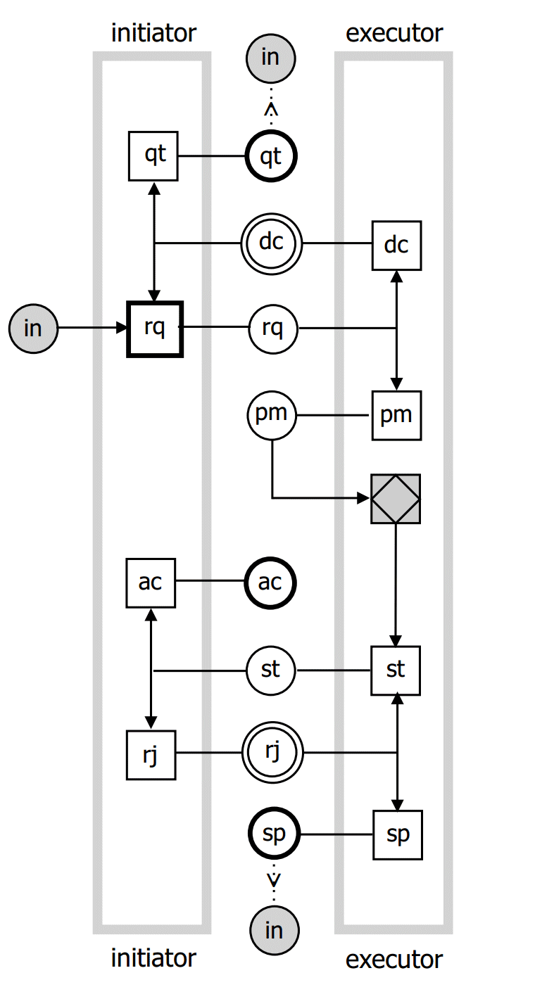

After the action request or a state the flow is extended with two
discussions. The actions (events) are displayed by squares. The actions
are: request, decline, quit, promise, state, reject, stop, accept.\
\
An action creates a fact, which is displayed with a circle. The
transaction has reached a certain state: requested, declined, quitted,
promised, stated, rejected, stopped, accepted.


  **Abbreviation**   **Action**   **State of Transaction**
  ------------------ ------------ --------------------------
  rq                 Request      Requested
  pm                 Promise      Promised
  st                 State        Stated
  ac                 Accept       Accepted
  dc                 Decline      Declined
  qt                 Quit         Quitted
  rj                 Reject       Rejected
  sp                 Stop         Stopped


The executor may not be able to execute the request. The executor
declines the request. The transaction is in a state of discussion in
which the actors talk to each other to agree. (A discussion state is
indicated by a white circle with double black border.)\
\
Usually the actors agree, and this results into a (modified) request and
a promise. When no agreement is reached the initiator quits the
transaction. The transaction has reached a final state, but failed.\
\
Something comparable happens after a state by the executor. The
initiator may not accept the product and/or service. The initiator
rejects the product. The transaction is in a state of discussion in
which the actors talk to each other to agree.\
 Usually the actors agree, and this results into a (modified) state and
a accept. When no agreement is reached the executor stops the
transaction. The transaction has reached a final state, but failed.


A complete transaction pattern arises when we also take into account the
fact that actors can revoke their primary actions (request, promise,
state, accept). The initiator can declare a revoke request and revoke
accept. The executor can always declare a revoke promise and revoke
state. A revoke must be followed by an allow or a refuse. An allow
changes the state of the transaction. An allow of a revoke request
changes the state of the transaction into \"initiated\". An allow of a
revoke promise changes the state of the transaction into \"requested\".
An allow of a revoke state changes the state of the transaction into
\"promised\". An allow of a revoke accept changes the state of the
transaction into \"stated\".\
\
A refuse doesn't change the state of the transaction.


  **Abbreviation**   **Action**       **State of Transaction**
  ------------------ ---------------- --------------------------
  rq                 Request          Requested
  pm                 Promise          Promised
  st                 State            Stated
  ac                 Accept           Accepted
  dc                 Decline          Declined
  qt                 Quit             Quitted
  rj                 Reject           Rejected
  sp                 Stop             Stopped
  rv rq              Revoke Request   Revoked Request
  rv pm              Revoke Promise   Revoked Promise
  rv st              Revoke State     Revoked State
  rv ac              Revoke Accept    Revoked Accept
  al                 Allow            Allowed
  rf                 Refuse           Refused


An examples to illustrate.\
\
The result was accepted by the initiator, and then the initiator detects
an error. The action accept is revoked, because the result is not
according to the request. The executor receives the revoke accept and
can allow or refuse it. A negotiation may start between the actors about
the error on the result. The actors can agree on a modified result. In
that case the action \"state\" is also revoked (and allowed). The
executor creates a customized result and states it.\
\
If the revoke is refused, the state of the transaction doesn't change
(and is accepted).\
\
Another examples to illustrate.\
\
The result has already been accepted, but the initiator wants something
else. The action request is revoked, because a different result is
requested. The executor receives the revoke request and can allow or
refuse it. A negotiation may start between the actors about a different
result. The actors can agree on a different result. In that case the
action \"request\" is revoked (and allowed). The initiator sends a
different request to the executor. The executor promises and states. The
initiator accepts the different result which is according to the
different request.\
\
If the revoke is refused, the state of the transaction doesn't change
(and is accepted).

## Definition of Framework

This chapter describes how a DEMO construction model can be modeled into
a framework by using VISI Standard version 1.6.

### DEMO or VISI framework?

From a framework it should be recognisable if all transactions are
according to VISI or according to reference framework DEMO. By adding
/DEMO to the namespace of VISI a framework will be recognisable as a
framework for DEMO usage. When there will by a new version of the VISI
Standard - version 1.7 (or higher namespace) - the DEMO framework will
be recognisable by the slash DEMO addition.\
\
Example of the namespace in a framework of VISI Standard, version
1.6:\<br\> '\<visiXML_VISI_Systematics
xmlns=\"http://www.visi.nl/schemas/20160331\"\>'\
\
Example of the namespace in a framework for reference framework
DEMO:\<br\> '\<visiXML_VISI_Systematics
xmlns=\"http://www.visi.nl/schemas/20160331/DEMO\"\>'\
\
Example of possible namespace in a framework of VISI Standard, version
1.7:\<br\> '\<visiXML_VISI_Systematics
xmlns=\"http://www.visi.nl/schemas/20191231\"\>'\
\
Example of the namespace in a framework for reference framework
DEMO:\<br\> '\<visiXML_VISI_Systematics
xmlns=\"http://www.visi.nl/schemas/20191231/DEMO\"\>'

### DEMO transaction pattern in VISI: default 4 states

In paragraph
\[3.2\](https://github.com/bimloket/visi/wiki/3.2-DEMO-happy-flow-in-a-VISI-frame)
is described how the standard DEMO transaction pattern is described in a
VISI framework. An important difference between the reference framework
for DEMO and the frameworks for VISI is that each transaction for DEMO
follows exactly the same pattern and therefore always contains the same
order of messages and states.

### DEMO revokes in VISI: seperate transactions

The complete transaction pattern (including revokes) can also be
described in the same way, but to simplify the modeling of frameworks,
it has been decided to record revokes as separate transactions in a
framework. This definition is described in paragraph
\[3.3\](https://github.com/bimloket/visi/wiki/3.3-DEMO-Herroepingen-vastleggen-in-een-VISI-raamwerk).

### Asynchronous & revokes

Paragraph
\[3.4\](https://github.com/bimloket/visi/wiki/3.4-DEMO-Crossing-messages-and-order-of-events)
explains how to deal with the asynchronicity of the VISI Standard and a
a result crossing messages/revokes and the sequences of these events.

## DEMO transaction with open standard VISI

### Fixed pattern for a VISI transaction

To understand the restrictions that need to be applied to a VISI
transaction to become a DEMO transaction a short summary is given of the
way a VISI transaction works.\
\
A VISI transaction has a role which starts the transaction. This is
called initiator. The initiator sends the first message of the
transaction to another role. This role is called the executor of the
transaction. A transaction has only two roles connected to it: initiator
and executor. After receiving the message the executor is owner of the
transaction. The initiator cannot send a second message in the same
transaction, because the initiator is not the owner of the transaction.
The executor is the owner and has to take action. The executor can
transfer the ownership back to the initiator by sending a message to the
initiator. So initiator or executor can never send a message twice in a
row. In the VISI Standard this behaviour is described by a property
initiatorToExecutor, which can be set to true or false. The property
belongs to MessageInTransactionType (MITT).\
\
There is no limit to the amount of messages within a transaction. A
transaction can consist of one message. For example the transaction
\"For You Information\". A transaction can consist of two messages. For
example \"Question - Answer\". Message \"Question\" needs to be sent
from initiator to executor, and executor has to reply with message
\"Answer\".\
\
A transaction can consist of a dozen messages. For example a transaction
about \"Contract Mutation\". The pattern of messages has to go from
initiator to executor to initiator to executor to initiator to etc.\
\
As described in chapter
\[2\](https://github.com/bimloket/visi/wiki/2.-DEMO-transaction-pattern)
a DEMO transaction has a fixed/predefined pattern with a fixed number of
messages and states. Special case is that two messages (\"promise\" and
\"state\") need to be sent after each other, but by the same role - the
executor. This behaviour differs from the VISI behaviour, but can be
modeled by setting the property initiatorToExecutor for both messages
(\"promise\" and \"state\") to false. So MessageInTransactionType of
\"promise\" and \"state\" need to have the value false for property
initiatorToExecutor.\
\
In theory, this restriction to the design of frameworks is already
possible with the first version of VISI, but this document applies to
version 1.6. (and higher).

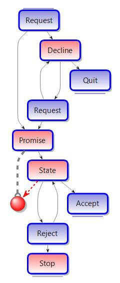

All VISI transactions must follow a fixed pattern to become a DEMO
transaction. The messages are:

-   Request;

-   Decline;

-   Quit;

-   Promise;

-   State;

-   Accept;

-   Reject;

-   Stop.

#### Main transaction

The figure above shows there are two messages Request. These are the
exact same messages. They are displayed as two messages, because
differentiation is needed between a) the message Request that starts a
transaction, and b) the message Request that follows after a message
Decline. According to the open standard VISI a message that starts a
transaction is recognized as a message that has no previous message.
Because there is a loop between message Request and message Decline,
only one message Request would be insufficient, because no message that
starts the transaction would be recognized.

1.  message Request has no previous message.

2.  message Decline has message Request (1.) and message Request (3.) as
    previous message.

3.  message Request has message Decline as previous message.

4.  message Quit has message Decline as previous message.

5.  message Promise has message Request (1.) and message Request (3.) as
    previous message.

6.  message State has message Promise as previous message.

7.  etc.

To stay as close as possible to the current open standard VISI this
solution is chosen to best fit the functional requirement of explicit
definition of the message that starts a transaction. An alternative
solution would be to work with a message Initialize that would indicate
the start of a transaction. This can be introduced in following versions
of this standard when the requirement to stay as close as possible to
the existing standard is dropped.

#### Sub transactions

Also (sub) transactions - started from a main transaction - use this
default pattern, and have two messages Request to define the message
that starts a transaction.

1.  message Request has a) message Request/Promise/State/Accept from
    main transaction as previous message, and b) the property
    firstMessage set to true.

2.  message Decline has message Request (1.) and message Request (3.) as
    previous message.

3.  message Request has a) message Decline as previous message, and b)
    the property firstMessage set to false.

4.  message Quit has message Decline as previous message.

5.  message Promise has message Request (1.) and message Request (3.) as
    previous message.

6.  message State has message Promise as previous message.

7.  etc.

### 3.2.2 Mandatory transactionPhase and predefined values

According to the open standard VISI the property transactionPhase of
MessageInTransactionType is optional, but to determine the (DEMO) phase
of a message the use of the property transactionPhase of
MessageInTransactionType is mandatory. TransactionPhaseTypes have
predefined ids (TPT_DEMO_STATE\_\...) and descriptions (REQUESTED,
PROMISED, STATED, ACCEPTED, QUITTED, DECLINED, REJECTED, STOPPED). All
values for ids and descriptions are capital letters.\
\
Every framework will have the following phases of a transaction:

```
<TransactionPhaseType id="TPT_DEMO_STATE_REQUESTED">
    <description>REQUESTED</description>
</TransactionPhaseType>
<TransactionPhaseType id="TPT_DEMO_STATE_PROMISED">
    <description>PROMISED</description>
</TransactionPhaseType>
<TransactionPhaseType id="TPT_DEMO_STATE_STATED">
    <description>STATED</description>`
</TransactionPhaseType>`
<TransactionPhaseType id="TPT_DEMO_STATE_ACCEPTED">
    <description>ACCEPTED</description>
</TransactionPhaseType>
<TransactionPhaseType id="TPT_DEMO_STATE_QUITTED">
    <description>QUITTED</description>
</TransactionPhaseType>
<TransactionPhaseType id="TPT_DEMO_STATE_DECLINED">
    <description>DECLINED</description>
</TransactionPhaseType>
<TransactionPhaseType id="TPT_DEMO_STATE_REJECTED">
    <description>REJECTED</description>
</TransactionPhaseType>
<TransactionPhaseType id="TPT_DEMO_STATE_STOPPED">
    <description>STOPPED</description>
</TransactionPhaseType>
```

### 3.2.3 Skip messages/transaction phases

To explicitly define if a message (and transaction phase) is applicable
in a transaction or if a message needs to be skipped, functionality is
introduced to flag a message as being 'HIDDEN'/'NOT ACTIVE'/'\...'. For
this flag an existing property of a MessageType is used: state. Property
state is a string, but the value of this string a predefined one:
PASSIVE. The value for state is in capital letters. Software that
designs the framework will have to work according to this rule and
visualize these messages differently. Software that executes the
framework will have to skip/ignore these messages.\
\
To minimize the size of frameworks 8 general messages must be used:

```
<MessageType id="MT_NO_REQUEST">
    <description>no request</description>
    <state>PASSIVE</state>
</MessageType>
<MessageType id="MT_NO_PROMISE">
    <description>no promise</description>
    <state>PASSIVE</state>
</MessageType>
<MessageType id="MT_NO_STATE">
    <description>no state</description>
    <state>PASSIVE</state>
</MessageType>
<MessageType id="MT_NO_ACCEPT">
    <description>no accept</description>
    <state>PASSIVE</state>
</MessageType>
<MessageType id="MT_NO_QUIT">
    <description>no quit</description>
    <state>PASSIVE</state>
</MessageType>
<MessageType id="MT_NO_DECLINE">
    <description>no decline</description>
    <state>PASSIVE</state>
</MessageType>
<MessageType id="MT_NO_REJECT">
    <description>no reject</description>
    <state>PASSIVE</state>
</MessageType>
<MessageType id="MT_NO_STOP">
    <description>no stop</description>
    <state>PASSIVE</state>
</MessageType>
```

Transaction specific MessageInTransactionTypes need to point to these
default PASSIVE messages.\
\
Example:

```
    <MessageInTransactionType id="mit5349-promise">
        <initiatorToExecutor>false</initiatorToExecutor>
        <message>
            <MessageTypeRef idref="MT_NO_PROMISE"/>
        </message>
        <previous>
            <MessageInTransactionTypeRef idref="mit5348-request"/>
            <MessageInTransactionTypeRef idref="mit5347-request"/>
        </previous>
        <transaction>
            <TransactionTypeRef idref="T11_1_Aanleveren_Omgevingsmelding"/>
        </transaction>
    </MessageInTransactionType>
```

A transaction with all messages set to PASSIVE is the best way to start
modelling a new transaction.


The messages that need to be sent between initiator and executor are
defined and the pointer to a PASSIVE message can be replaced in the
MessageInTransactionType. For example a message Promise:

```
    <MessageInTransactionType id="mit5349-promise">
        <initiatorToExecutor>false</initiatorToExecutor>
        <message>
            <MessageTypeRef idref="M11_1_Belofte_Aanleveren_Omgevingsmelding"/>
        </message>
        <previous>
            <MessageInTransactionTypeRef idref="mit5348-request"/>
            <MessageInTransactionTypeRef idref="mit5347-request"/>
        </previous>
        <transaction>
            <TransactionTypeRef idref="T11_1_Aanleveren_Omgevingsmelding"/>
        </transaction>
    </MessageInTransactionType>
```

### Sub transations

A sub transaction can only be started from a main transaction when the
phase of the main transaction is: REQUESTED, PROMISED, STATED or
ACCEPTED.\
\
Transferring from main to sub transaction and from sub to main
transaction must be done conform the default transaction pattern phases.
For example:

-   From main transaction (phase=STATED) to sub transaction;

-   Execution of sub transaction (phase=ACCEPTED) by sending messages
    Request, Promise, State and Accept;

-   Return to main transaction (phase=STATED);

-   Main transaction has two options to continue: message Accept or
    message Reject.

According to the open standard VISI main and sub transactions need to be
designed cascading. This means from main transaction T1 to sub
transaction T66, to sub transaction T77, back to sub transaction T66,
back to main transaction T1 (for short: T1\>T66\>T77\>T66\>T1). Skipping
a sub transaction on the way back is NOT allowed (for short: NOT
T1\>T66\>T77\>T1). To model connecting DEMO transactions cascading is
not mandatory. For instance because of a message Quit or message Stop a
sub transaction can be terminated. DEMO transactions can be linked as a
chain of transactions, and don't have to return to the main transaction.
Software has to work according to the rule that after a message Quit or
message Stop of a sub transaction the flow returns to the main
transaction, and needs to be continued in the main transaction at the
point where the sub transaction was started. The exact position in the
main transaction can be derived from the transaction phase, because
there is a default transaction pattern with default phases.\
\
Mandatory sub transactions can be modeled a) with properties
sendBefore/sendAfter of MITTConditions, or b) by simply continuing into
a sub transaction by skipping message Quit and message Stop (see
PASSIVE).\
\
To model the execution order of sub transaction MITTConditions
(properties sendBefore/sendAfter) need to be used - in case of multiple
sub transactions. Example: How to model requesting an \"Advise\" before
requesting an \"Approval? Message Request and message State of sub
transaction \"Advise\" have a sendBefore pointing to the first message
Request of sub transaction \"Approval\". The result is that first the
transaction \"Advise\" needs to be started/requested and stated, before
the sub transaction \"Approval\" can be started/requested.

### Fact Bank per transaction

DEMO has a Fact Bank, but open standard VISI doesn't have such a central
storage of all facts which is accessible to all actors (initiators and
executors) of all transactions. The reason is that all actors don't work
in the same organisations, and transactions are inside an organisation
or between organisations. In other words there is not one publicly
available Fact Bank for all organisations involved in executing
transactions.\
\
Every instance of a transaction can be initiated by a different
organisation (with different IT systems). Coordination and Production
Facts between organisations are transferred digitally and organisations
cannot access each others Fact Banks for Coordination and Production
Facts of internal transactions of other organisations. For example: the
internal Coordination and Production Facts of an insurance company are
not accessible to the sub contractor hospitals, and vice versa the
internal Coordination and Production Facts of the hospitals are not
accessible to the contractor insurance company.\
\
According to the open standard VISI every transaction contains the
Coordination and Production Facts that are necessary for that particular
transaction. Therefore Coordination and Production Facts can only be
transferred in a transaction by transferring messages and attachments.\
\
Because dependent (internal) sub transactions are initiated by other
organisations, facts from main transaction need to be transferred to
dependent sub transaction if this particular sub transaction needs those
Coordination and Production Facts.\
\

#### Remark

During the creation of this documentation it was decided to always
include the complete transaction pattern in a framework. This means that
skipped messages are explicitly modeled as implicit messages (see
PASSIVE). These implicit messages always appear as
MessageInTransactionType (MITT) in the frameworks. After all, when the
MITTs are not included in the framework, an alternative has to be
designed for capturing the following MITT properties:

-   transactionPhase

-   openSecondaryTransactionsAllowed

Future discussion can arise, and this discussion has also been conducted
(by JL, JvG, GS) whether it is necessary to include MITTs in the
framework. The properties transactionPhase and
openSecondaryTransactionsAllowed could then be added to MessageType.
This, however, requires an amendment to the open standard VISI (and we
don't want to change it). For this reason, we have opted to continue
working with MITTs (for the time being).\
\
Also the size of a framework is a point of attention. That is why only 8
general messages are allowed to define implicit messages (see PASSIVE).

## Revokes in a Transaction Tree

The open standard VISI has the concept of replying on a received message
like a ping pong game. In ping pong only one player is allowed to hit
the ball (depending where the ball is on the table), and the ball is
only allowed to be fit once by one player, and then the other player has
to hit it, etc. In VISI the initiator and executor send messages one by
one. It is always clear which actor needs to reply to a received
message.\
\
Although communication is asynchronous it is always clear which actor is
the one to continue the transaction by replying to the received
message.\
\
By introducing the option to revoke a reply the concept of replying on a
received message like a ping pong game is gone.\
\
To model the 4 revocation patterns of a DEMO transaction in every
transaction will lead to much bigger and cluttered transactions, which
are hard to design. A more efficient solution was chosen: the 4
revocation patterns of DEMO are modeled as separate transactions which
are valid to ALL transactions of a framework. Software for designing and
executing transactions need to follow this strict guideline.\
\
By letting go of the concept of sending and receiving messages,
revocations can also be modeled in a VISI framework. The complete
tranaction pattern that is realized with this makes the construction of
frameworks, however, unclear and labor-intensive. In this trailer, it
was therefore decided to model the 4 revocation patterns of DEMO as
separate transactions and to provide software builders with a guideline
on how to deal with these separate revoke transactions.\
\
As a result if revokes are present in a framework then as a consequence
a transaction can never be really closed, because the last message
Accept with the status 'ACCEPTED' can still be revoked. (But this revoke
can of course be denied.)\
\
The 4 revocation transactions are \"REVOKE REQUEST\", \"REVOKE
PROMISE\", \"REVOKE STATE\" and \"REVOKE ACCEPT\". These should be
modeled in a framework as follows.


The ids of the transactions are predefined:

```
    <TransactionType id="TT_DEMO_Revoke_Pattern_Request">
        <description>DEMO REVOKE PATTERN - REQUEST</description>
        <initiator>
            <RoleTypeRef idref="RT_Initiator"/>
        </initiator>
        <executor>
            <RoleTypeRef idref="RT_Executor"/>
        </executor>
    </TransactionType>
    <TransactionType id="TT_DEMO_Revoke_Pattern_Promise">
        <description>DEMO REVOKE PATTERN - PROMISE</description>
        <initiator>
            <RoleTypeRef idref="RT_Initiator"/>
        </initiator>
        <executor>
            <RoleTypeRef idref="RT_Executor"/>
        </executor>
    </TransactionType>
    <TransactionType id="TT_DEMO_Revoke_Pattern_State">
        <description>DEMO REVOKE PATTERN - STATE</description>
        <initiator>
            <RoleTypeRef idref="RT_Initiator"/>
        </initiator>
        <executor>
            <RoleTypeRef idref="RT_Executor"/>
        </executor>
    </TransactionType>
    <TransactionType id="TT_DEMO_Revoke_Pattern_Accept">
        <description>DEMO REVOKE PATTERN - ACCEPT</description>
        <initiator>
            <RoleTypeRef idref="RT_Initiator"/>
        </initiator>
        <executor>
            <RoleTypeRef idref="RT_Executor"/>
        </executor>
    </TransactionType>
```

Also the ids and description of the transaction phases are predefined:

```
    <TransactionPhaseType id="TPT_DEMO_STATE_REVOKED_ACCEPT">
        <description>REVOKED ACCEPT</description>
    </TransactionPhaseType>
    <TransactionPhaseType id="TPT_DEMO_STATE_ALLOWED_REVOKE_ACCEPT">
        <description>ALLOWED REVOKE ACCEPT</description>
    </TransactionPhaseType>
    <TransactionPhaseType id="TPT_DEMO_STATE_REFUSED_REVOKE_ACCEPT">
        <description>REFUSED REVOKE ACCEPT</description>
    </TransactionPhaseType>
    <TransactionPhaseType id="TPT_DEMO_STATE_REVOKED_PROMISE">
        <description>REVOKED PROMISE</description>
    </TransactionPhaseType>
    <TransactionPhaseType id="TPT_DEMO_STATE_ALLOWED_REVOKE_PROMISE">
        <description>ALLOWED REVOKE PROMISE</description>
    </TransactionPhaseType>
    <TransactionPhaseType id="TPT_DEMO_STATE_REFUSED_REVOKE_PROMISE">
        <description>REFUSED REVOKE PROMISE</description>
    </TransactionPhaseType>
    <TransactionPhaseType id="TPT_DEMO_STATE_REVOKED_REQUEST">
        <description>REVOKED REQUEST</description>
    </TransactionPhaseType>
    <TransactionPhaseType id="TPT_DEMO_STATE_ALLOWED_REVOKE_REQUEST">
        <description>ALLOWED REVOKE REQUEST</description>
    </TransactionPhaseType>
    <TransactionPhaseType id="TPT_DEMO_STATE_REFUSED_REVOKE_REQUEST">
        <description>REFUSED REVOKE REQUEST</description>
    </TransactionPhaseType>
    <TransactionPhaseType id="TPT_DEMO_STATE_REVOKED_STATE">
        <description>REVOKED STATE</description>
    </TransactionPhaseType>
    <TransactionPhaseType id="TPT_DEMO_STATE_ALLOWED_REVOKE_STATE">
        <description>ALLOWED REVOKE STATE</description>
    </TransactionPhaseType>
    <TransactionPhaseType id="TPT_DEMO_STATE_REFUSED_REVOKE_STATE">
        <description>REFUSED REVOKE STATE</description>
    </TransactionPhaseType>
```

#### Guideline for framework designers

The framework designer starts by downloading the \[default framework
with the DEMO transaction
pattern\](https://github.com/bimloket/visi/blob/master/ISSUES%20docs/DEMO_voorbeeld_met_revoke_subtransacties_v2%20(1).xml).\
In this basic framework for DEMO with open standard VISI, examples of
the 4 revocation transactions are modelled in accordance with DEMO 3.
These 4 revocation transactions must be present in the exact same way in
every project specific framework to unlock revocation options. The
message Revoke \..., Allow, and Refuse always have the same message
content (ComplexElements and SimpleElements). The ids of the messages
are: MT_Revoke_Accept, MT_Revoke_Promise, MT_Revoke_Request,
MT_Revoke_State, MT_Allow, MT_Refuse. These ids are reserved for the 4
revocation transactions and only these ids must unlock revoke
functionality (when executing DEMO transactions). If the framework
designer does not want to allow these revocation options, the 4
revocation transactions need to be excluded from the project specific
framework.

#### Software Guidelines

If one or more of the 4 revocations transactions are available in a
framework, the software must offer these revocation options to the user
in any transaction when it is valid according to the phase of the
transaction. This means that a transaction REVOKE REQUEST can only be
initiated from a sent message Request. The REVOKE REQUEST transaction is
linked as a sub transaction from the message where the REVOKE REQUEST
transaction was called. For the link the property
initiatingTransactionMessageID is used. The message MT_Revoke_Request
has this property.\
\
So when a transaction REVOKE STATE is initiated from a STATE message in
transaction T1, the STATE message becomes the parent of transaction
REVOKE STATE. This is recorded in the property
initiatingTransactionMessageID of the REVOKE message by referring to the
id of the message from which the REVOKE message was initiated. Thus, in
the above example, in the REVOKE message as
initiatingTransactionMessageID the id of the STATE message is
registered.\
\
In this case property openSecundaryTransactionsAllowed (false/true)
cannot be used to enforce first completing the REVOKE transaction before
the main transaction T1 continues. For this reason, software must act in
such a way that the REVOKE transaction is processed before main
transaction T1 continues.\
\

#### Revoke of main transaction and open sub transactions

Because REVOKE transactions are modeled as separate transactions, there
are no 'connections' of message MT_Allow or message MT_Refuse back to
transaction T1. The follow-up message in T1 that is allowed after an
ALLOW or REFUSE of a REVOKE can be determined as follows.\
\
Upon receiving of a message MT_Allow, track back in the REVOKE
transaction for the previous message to determine if it is an ALLOW of a
revoke request, promise, state or accept. There are now 4 possibilities:

1.  revoke request -\> allow, the main transaction cannot be continued
    because the transaction phase is QUITTED

2.  revoke promise -\> allow, the main transaction can continue with the
    messages Promise or Decline from transaction phase REQUESTED

3.  revoke state -\> allow, the main transaction can continue with the
    message State from transaction phase PROMISED

4.  revoke accept -\> allow, the main transaction can continue with the
    messages Accept of Reject with transaction phase STATED

Ad. 1. According to DEMO a revoke of a Request results into a
quit/termination of the transaction.\
\
Upon receiving of a message MT_Refuse, there is one possibility: 5.
revoke -\> refuse, the main transaction continues where it was before
the revoke transaction was initiated

#### Content of revoke messages

Because there are only 4 revocation transaction and 6 revocation
messages the content of the 6 revocation messages have the same
properties for all transaction on which the revocation transactions are
initiated.\
\
The content of the 6 revocation messages are predefined but can best be
held simple and focused on executing revocation transactions. For
example:

```
    <MessageType id="MT_Revoke_Request">
        <description>... (REVOKE REQUEST)</description>
        <complexElements>
            <ComplexElementTypeRef idref="CET_Request"/>
            <ComplexElementTypeRef idref="CET_Comments"/>
            <ComplexElementTypeRef idref="CET_Response"/>
        </complexElements>
    </MessageType>
    <ComplexElementType id="CET_Request">
        <description>Request</description>
        <simpleElements>
            <SimpleElementTypeRef idref="SET_Request"/>
        </simpleElements>
    </ComplexElementType>
    <SimpleElementType id="SET_Request">
        <description>request</description>
        <userDefinedType>
            <UserDefinedTypeRef idref="UDT_StringMandatory"/>
        </userDefinedType>
    </SimpleElementType>
    <ComplexElementType id="CET_Response">
        <description>Response</description>
        <simpleElements>
            <SimpleElementTypeRef idref="SET_ResponseDate"/>
        </simpleElements>
    </ComplexElementType>
    <SimpleElementType id="SET_ResponseDate">
        <description>response date</description>
        <userDefinedType>
            <UserDefinedTypeRef idref="UDT_Date"/>
        </userDefinedType>
    </SimpleElementType>
```

#### Revokes & sub transactions

When a main transaction - that has already started one or more sub
transactions - is receiving a request revoked then this revoke is
handled as follows:

-   If property openSecondaryTransactionsAllowed = false and sub
    transactions are open, then main transaction is NOT allowed to be
    revoked.

-   If property openSecondaryTransactionsAllowed = true and sub
    transactions are open, then main transaction is allowed to be
    revoked. Sub transactions stay open, but can optionally be revoked
    by sending Revoke Request(s).

#### Summary

-   REVOKE messages have fixed messaging types (6 type:
    MT_Revoke_Accept, MT_Revoke_Promise, MT_Revoke_Request,
    MT_Revoke_State, MT_Allow, MT_Refuse)

-   REVOKE transactions can only be initiated from the corresponding
    message (REVOKE REQUEST from a REQUEST, etc.)

-   REVOKE transactions become sub-transactions of the transactions from
    which they are initiated. This is recorded with the property
    initiatingTransactionMessageID

-   REVOKE transactions are processed first before the main transaction
    continues.

-   REVOKE transactions - if present in the framework - always apply to
    all transactions.

-   REVOKE of (sub) transactions are handled as described above.

## DEMO Crossing Messages (and order of events)

Organisations communicating via the open standard VISI are located at a
different location and in different networks. The exchange of
information is not synchronized. Like email messages can cross each
other on the internet. This chapter explicitly describes what rules
apply if two DEMO messages cross each other.\
\
VISI is ASYNCHRONE communication. In standard VISI communication this is
not an issue because there is no possibility for initiator or executor
to send a second message before a reply is received. With the
introduction of Revokes it will be possible to send two messages (a
normal message and a revoke). Revoke has a higher priority than non
revoke messages to be executed. So the revoke needs to be handled before
any normal message in this transaction can be send.\
\

#### Crossing revoke and message of main transaction

It is possible that, for example, the executor sends a Revoke State at
the exact same moment as the initiator sends a Accept. The priority when
a Revoke crosses with a message of main transaction is first handle the
Revoke.\
\
In case the Revoke is replied with Refuse, the message of the main
transaction determines the state of the transaction. In case the Revoke
is replied with Allow, this determines the state of the transaction. The
state becomes the state prior the revoke. For example:

-   An Allow of Revoke Requests results in state of transaction being
    ???.

-   An Allow of Revoke Promise results in state of transaction being
    Requested.

-   An Allow of Revoke State results in state of transaction being
    Promised.

-   An Allow of Revoke Accept results in state of transaction being
    Stated.

In more detail:

-   Organisation A sends a Accept;

-   Organisation B sends a Revoke State;

-   Organisation B receives the Accept, and sends a confirmation
    message;

-   The main transaction of organisation A is not locked;

-   The main transaction of organisation B is not locked;

-   Organisation A receives the Revoke State and sends a confirmation
    message;

-   The main transaction of organisation A is locked;

-   The main transaction of organisation B is locked;

-   First organisation A needs to reply to the Revoke Accept (with Allow
    or Refuse);

-   Organisation B receives organisation A's responds (Allow or Refuse)
    to the Revoke State and sends a confirmation message;

-   The main transaction of organisation B is unlocked;

-   Organisation A receives the confirmation message from organisation
    B;

-   The main transaction of organisation A is unlocked;

-   Organisation B has the reply (Allow or Refuse) to its Revoke State
    and organisation B can now determine the state of the main
    transaction; In case of Refuse the state of the transaction is
    Accepted. And in case of Allow the state of the transaction is
    Promised.

#### Crossing revokes

It is possible that, for example, the executor sends a revoke at the
exact same moment as the initiator sends a revoke. The priority when two
Revokes cross each other is backwards in the transaction pattern. The
order is: First Revoke Accept, then Revoke State, then Revoke Promise,
then Revoke Request\
\
The last Revoke that is replied with Allow determines the phase of the
transaction. Normally this will be a 'happy flow' transaction phase
message but in the case of two crossing revokes both revokes need to be
resolved before the regular message flow continues.\
\
When a revoke is sent (and confirmed with a confirmation message), then
that (side of the) transaction is frozen until it is replied with an
Allow or Refuse. When revokes cross each other (and are both confirmed)
that means both sides of the transaction are frozen until both revokes
are replied (with allow or refuse).\
\
When 2 Revokes cross each other the following rules apply:

-   before the main transaction continues, both revokes must be replied
    (with Allow or Refuse);

-   if both revokes are refused, the state of the transaction remains
    the same as before the revokes;

-   if one of the two revokes is allowed (and the other refused) the
    state of the transaction is equal to the state prior the revoke
    (Allow of Revoke State result in state Promised);

-   if both revokes are allowed, the state of the transaction is equal
    to the highest state reached by 1 of both revokes. (State order: 1.
    Request, 2. Promise, 3. State, 4. Accept).

Example:

-   Both organisations send a revoke at the same time;

-   Both organisations confirm the reception of the revokes;

-   Each organisation handles the revoke they have received (by replying
    with allow or refuse);

-   When both revokes are handled, replied and the replies are
    confirmed, the state of the transaction is determined, and the main
    transaction will continu.

In more detail:

-   Organisation A sends a Revoke Accept;

-   Organisation B sends a Revoke State;

-   Organisation B receives the Revoke Accept, and sends a confirmation
    message;

-   The main transaction of organisation A is locked;

-   Organisation A receives the Revoke State and sends a confirmation
    message;

-   The main transaction of organisation B is locked;

-   Organisation A replies the Revoke State (with Allow or Refuse);

-   Organisation B replies the Revoke Accept (with Allow or Refuse);

-   Organisation B receives organisation A's responds (Allow or Refuse)
    to the Revoke State and sends a confirmation message;

-   The main transaction of organisation A is still locked;

-   The main transaction of organisation B is still locked;

-   Organisation A receives organisation B's responds (Allow or Refuse)
    to the Revoke Accept and sends a confirmation message;

-   Organisation A receives the confirmation message from organisation
    B;

-   Organisation B receives the confirmation message from organisation
    A;

-   Organisation A has the reply (Allow or Refuse) to its Revoke Accept
    and a confirmation message on its reply to the revoke of
    organisation B, and organisation A can now determine the state of
    the main transaction;

-   Based on the state of the main transaction organisation A can or
    cannot send a new message to organisation B;

-   Organisation A can also send another Revoke message (for example
    Revoke Request);

-   Organisation B has the reply (Allow or Refuse) to its Revoke State
    and a confirmation message on its reply to the revoke of
    organisation A, and organisation B can now determine the state of
    the main transaction;

-   Based on the state of the main transaction organisation B can or
    cannot send a new message to organisation A;

-   Organisation B can also send another Revoke message (for example
    Revoke Promise).

## Getting started with DEMO Transaction Pattern

### Prerequisite

Before starting to use the DEMO transaction pattern gain knowledge about
it by reading a \[book\](http://www.springer.com/la/book/9783540291695)
or following a \[course\](http://www.ee-institute.org/en/courses).

### Start with a VISI framework

Translating a VISI transaction to a DEMO transaction pattern is not
straight forward, and cannot be done automatically. The framework
designer needs to have knowledge about the VISI transaction and
interpret the name of VISI messages. As a first step the VISI messages
need to be tagged with the default actions from the DEMO transaction
pattern (request, decline, quit, promise, state, reject, stop, accept).
Also the designer needs to search for the modelling in a VISI
transaction of a revoke by means of a VISI message (\"intrekking
melding\").\
\
Second step is to determine which of the default actions of the DEMO
transaction pattern are not available a VISI messages. These actions are
added to the framework as implicit actions (see chapter
\[\...\](https://github.com/bimloket/visi/wiki/Definition-of-Framework)).\
\
Third step it to cut a VISI transaction up into one or more default DEMO
transaction patterns.\
\
Fourth step is to check if every action is only used once in a DEMO
transaction pattern. For example if there are two different message with
are a state these messages need to be combined, or the ransaction needs
to be split in two transactions. Such messages can be two state
message: 1) \"positief advies\", 2) \"negatief advies\". This can be
combined into one message \"advies\". The message contains an simple
element with the type of advise: \"positief\" or \"negatief\".\
\
The appendix \"\[Bijlage A Translate VISI to DST
method\](https://github.com/bimloket/visi/wiki/Bijlage-A---Translate-VISI-to-DST-method)\"
expands on this method of translating VISI transactions to DEMO
transactions. The appendix \"\[Bijlage B Translate VISI to DST
example\](https://github.com/bimloket/visi/wiki/Bijlage-B---Translate-VISI-to-DST-example)\"
gives an extensive example of how to translate one VISI transaction into
several DEMO transaction patterns.

### Start from scratch

The framework designer starts by downloading the \[default framework
with the DEMO transaction pattern\]
https://github.com/bimloket/visi/blob/master/ISSUES%20docs/DEMO_voorbeeld_met_revoke_subtransacties_v2%20(1).xml).

## Attachment A: Translate VISI to DST method

### Method for converting a VISI framework to the DEMO standard transaction pattern

There are a number of guidelines you can follow to use the standard
transaction pattern in VISI as described in the DEMO methodology. The
most important points of attention are described below. Every message in
an (existing) VISI transaction must be identified as 1 of the 14
different phases in the DST below to make the transaction compatible
with the DST.\
\
The happy flow in the DEMO standard transaction pattern (abbreviated as
DST) consists of 4 consecutive steps or statuses. NB: we do not have the
"Execute" phase in this application of the DST as we only model and
automate the communication.

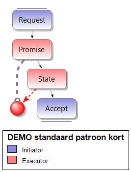

In addition, there are 4 options to deviate from the happy flow.


And for every happy flow status there is a Revoke phase, which must
always be responded to with an Accept or Refuse. NOTE: In this
application of the DST, the Allow and Refuse messages are always the
same, regardless of which Revoke they are used for.


Because all phases are always available as options in the DST, the first
step in converting a VISI framework to a DST compatible framework is to
create so-called "dummy messages". Those are the 8 basic phases of the
DST, so everything except the revokes. In the framework you can set the
"state" of these dummy messages to "passive", thus indicating that these
phases are implicit and should be skipped. It is useful to give them a
recognizable name and ID, for example "NO_REQUEST" and "NO_STOP". These
dummy messages will be used to fill in the missing phases in the DST. It
is not necessary to create dummy messages for the revokes because they
are always available as an option and will therefore not be specifically
modeled.


After creating the 8 dummy messages you can analyze the VISI transaction
to determine how often the DST occurs. In a regular VISI transaction it
is possible to use an infinite number of messages, but the DST only has
the 14 prescribed phases. This may result in a VISI transaction being
divided into multiple DST transactions.\
\
Identifying the existing VISI messages to one of the phases from the DST
is a matter of insight and can lead to discussion. For example,
reporting a contract change can be seen as a State, but also as a
Request. In the worked example it was decided to model this as a
Request. This choice has been made because this is the first message in
the transaction and because you can argue that no (implicit) Request has
yet been made.\
\
NB: You could also argue that a contract change is a Revoke Request, but
since building the contract is not included in the framework used, the
original Request does not exist and therefore you cannot start with a
Revoke Request.\
\
NB: When supplying previously (contractually) agreed documents, you can,
for example, argue that a clear request has been made in advance (in the
contract). If building a contract is not included in the example
framework used, the first message of another VISI transaction, for
example the delivery of a document for acceptance, could be seen as a
State.\
\
NB: Since the argumentation regarding naming phases in processes can
differ between framework builders, it is possible that the same process
will be modeled in different ways. The standard cannot change this, at
most examples and templates can be provided as guidance.\
\
When the messages are identified as phases in the DST you can
distinguish which phases belong together in the same DST transaction.
For example, by changing the naming of the message to
"T_01_Request_notification_of_a_change" you can also make this visible
in the framework. If there are missing phases you can fill them with the
dummy messages. You always use the same messages for this.\
\
It may happen that there are VISI messages that combine multiple DST
phases in 1 message. In that case, split the message into multiple
messages so that they can be modeled in their own DST transaction.


Conversely, there may also be multiple VISI messages that concern the
same DST phase. This often concerns a difference in the content of the
message, but the result is the same. For example, whether a payment is
made via cash or ATM. The result is the same, i.e. payment is made, but
the information required may differ.


NB: Since we do not have a fact base in VISI and all information is in
the message - a difference in the required information means that
different messages have to be used - the cash message does not contain a
\"PIN code\" field. You will then receive different messages for the
same State. In addition, it may also happen that other messages or
dependent transactions are initiated based on the chosen method. For
example, if you opt for cash payment, change may be given back - which
would result in an additional message (transaction?).\
\
Subtransactions (dependent transactions) can be modeled with the DST in
the same way as the main transaction. These will often consist of a
single DST, often with missing phases. The entry and exit of the
subtransaction will sometimes determine what options exist. For example,
a judgment request that appears in the main transaction in a State
message can be ignored (for example, giving a judgment of non-acceptance
and still accepting it). Another example is a mandate request where,
after the mandate (State) message that has not been given, only a
Decline or Reject can be selected when returning to the main
transaction.\
\
Existing options in the system regarding mit conditions and whether or
not you can continue with the main transaction if a sub-transaction is
open will continue to exist.\
\
A detailed practical example of this method can be found in \[Appendix B
Translate VISI to DST
example\](https://github.com/bimloket/visi/wiki/Bijlage-B---Translate-VISI-to-DST-example).

## Attachment B Translate VISI to DST example

### Example: Converting UAV2012 transaction changes to DEMO standard transaction pattern

Original VISI transactions:\
\
TR_01 Submission: notification of a change - from OG_1 (blue, initiator)
to ON_1 (red, executor) TR_02 Judgment request: quotation change - from
OG_1 (blue, initiator) to OG_2 (red, executor) TR_03 Advice request:
(quotation) change - from OG_2 (blue, initiator) to OG_3 (red, executor)


Identifying DEMO phases in the VISI transaction:


Notes on identifying DST phases in existing UAV2012 changes
transactions:

-   The main transaction consists of several DEMO transactions

-   Subtransactions such as judgment requests or advice requests often
    consist of fewer phases in VISI frameworks (e.g. only request and
    state), in this example no route is yet defined from the judgment in
    the main transaction. For example, with a mandate you could see that
    the sub-transaction already indicates which message you will end up
    with in the main transaction - now you can ignore the judgment.

-   Not all phases occur as a message (e.g. no promise, no stop in
    "DEMO_TR_01")

-   Some phases occur more often per transaction (e.g.
    "DEMO_TR_03_STATE"), because the content of the message may differ
    (payment per installment or as a separate order)

-   Payment can be made in 3 different ways, immediately the total,
    partially and after the parts a final term. These are now 3
    different transactions because the result is different, also because
    otherwise you cannot make multiple requests with different content.
    But actually these transactions are very similar. When do you split
    transactions? If the product/result is different. Does a different
    amount mean a different result? Does a different accounting method
    produce a different result? (in due course as a separate assignment)

-   The "DEMO_TR_03_04_05_QUIT - Withdraw: change by ON" is 1 message in
    the VISI framework, in a DEMO framework this would be 3, 1 per DEMO
    transaction

-   Naming of messages should better reflect the result/product of the
    DEMO transaction - e.g. "DEMO_TR_03_04_05_QUIT - Withdrawal: change
    by ON", should be "Withdrawal: payment by ON" .

DEMO transaction 01 (DEMO_TR_01_Change_approved)

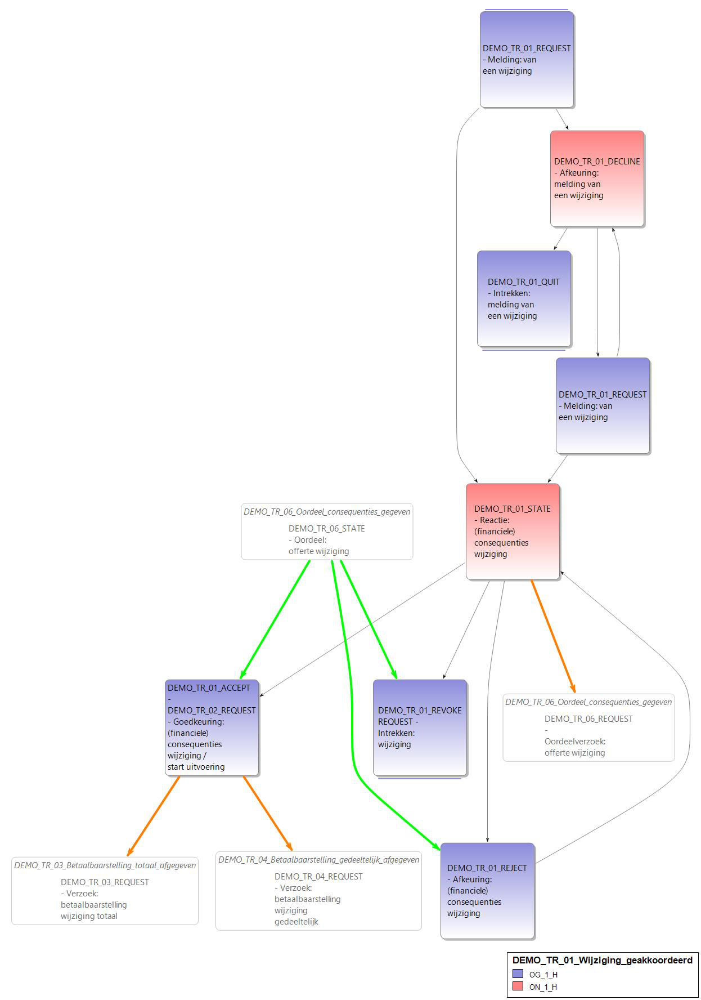

DEMO transaction 01 including passive (dummy) messages

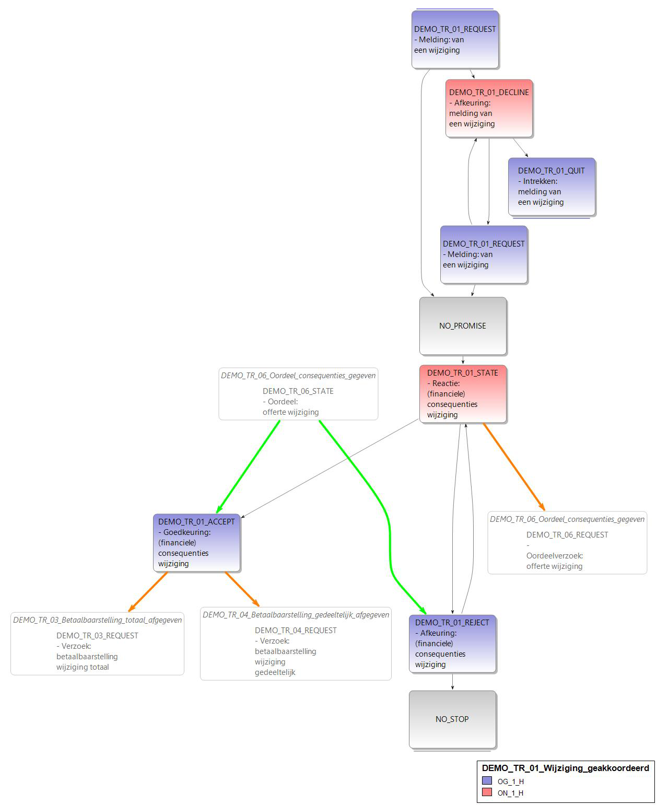

DEMO transactie 03 (DEMO_TR_03_Betaalbaarstelling_totaal_afgegeven)


DEMO transaction 03 including passive (dummy) messages


DEMO transaction 03a including passive (dummy) messages - split into a
and b because there are different State options, where the content of
the message may differ even though the result is the same.\
\
DEMO_TR_03a_Payment_total_in_term


DEMO transaction 03b including passive (dummy) messages - split into a
and b because there are different State options, where the content of
the message may differ even though the result is the same.\
\
DEMO_TR_03b_Payment_total_single_order

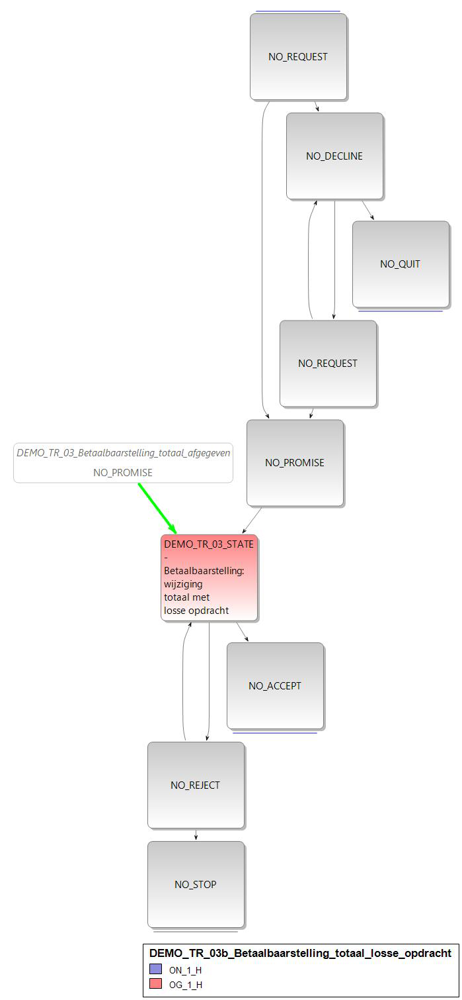

DEMO transaction 04 (DEMO_TR_04_Payment_partial_issued)

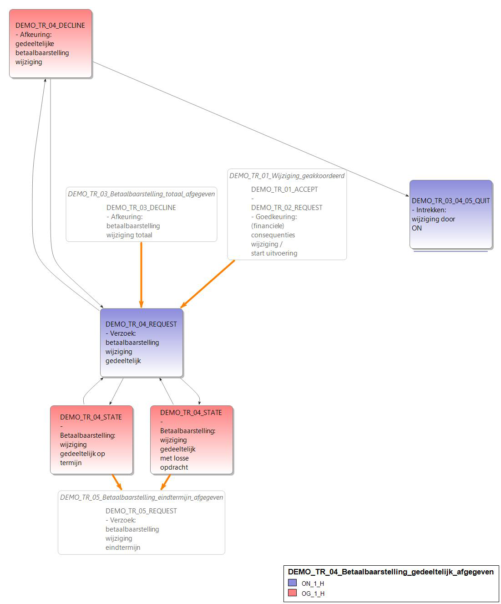

DEMO transaction 04 including passive (dummy) messages


DEMO transaction 04a including passive (dummy) messages - split into a
and b because there are different State options, where the content of
the message may differ even though the result is the same.\
\
DEMO_TR_04a_Payment_partial_in_term

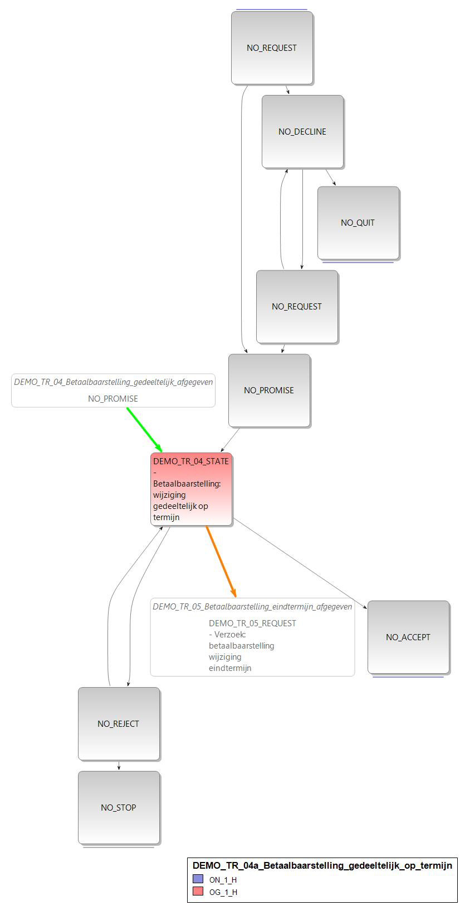

DEMO transaction 04b including passive (dummy) messages - split into a
and b because there are different State options, where the content of
the message may differ even though the result is the same.\
\
DEMO_TR_04b_Payment_partial_single_order


DEMO transaction 05 (DEMO_TR_05_Payment_final term_issued)

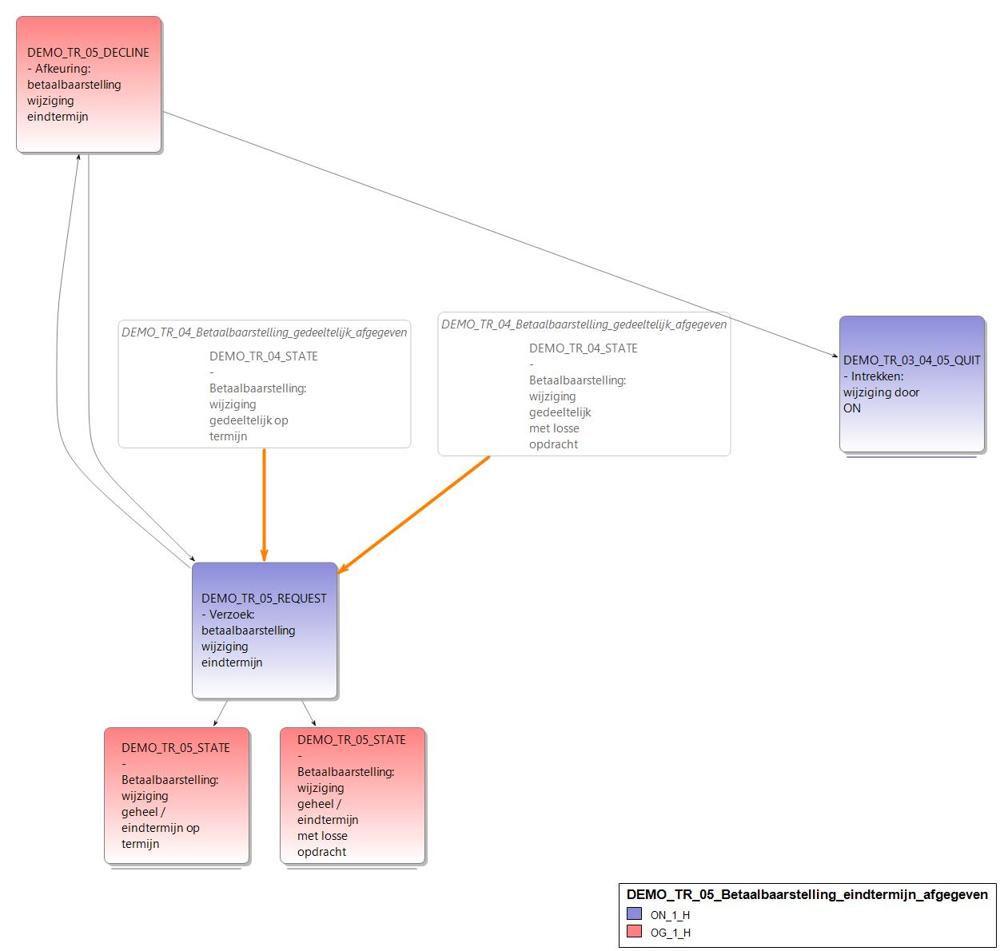

DEMO transaction 05 including passive (dummy) messages


DEMO transaction 05a including passive (dummy) messages - split into a
and b because there are different State options, where the content of
the message may differ even though the result is the same.\
\
DEMO_TR_05a_Payment_final term_in_term

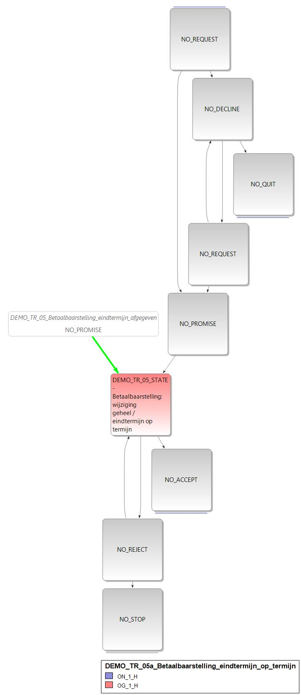

DEMO transaction 05b including passive (dummy) messages - split into a
and b because there are different State options, where the content of
the message may differ even though the result is the same.\
\
DEMO_TR_05b_Payment_final term_single_assignment


DEMO transaction 06 (DEMO_TR_06_Judgment_consequences_given)


DEMO transaction 06 including passive (dummy) messages

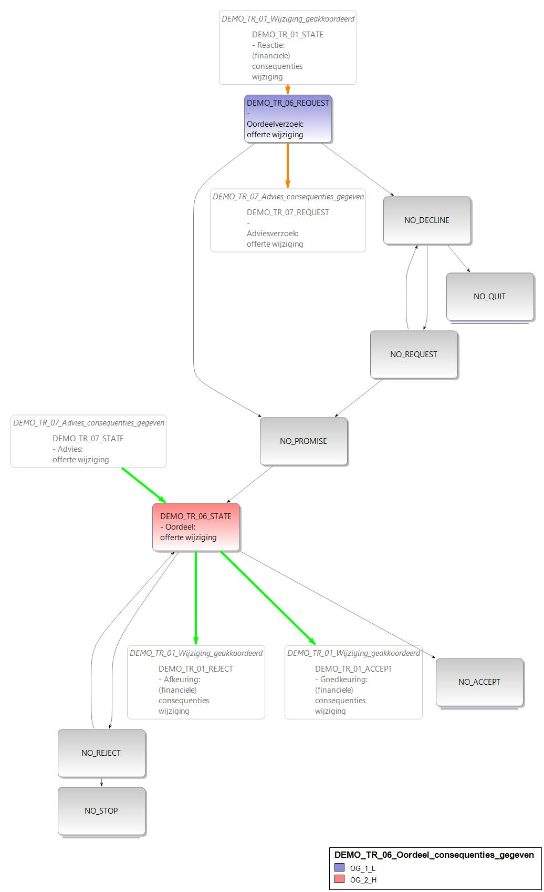

DEMO transaction 07 (DEMO_TR_07_Advice_consequences_given)

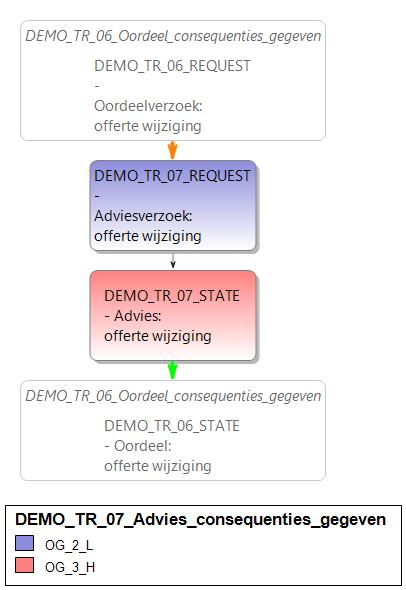

DEMO transaction 07 (DEMO_TR_07_Advice_consequences_given)


Total scenario of all broken down DEMO compatible transactions with
dummy messages

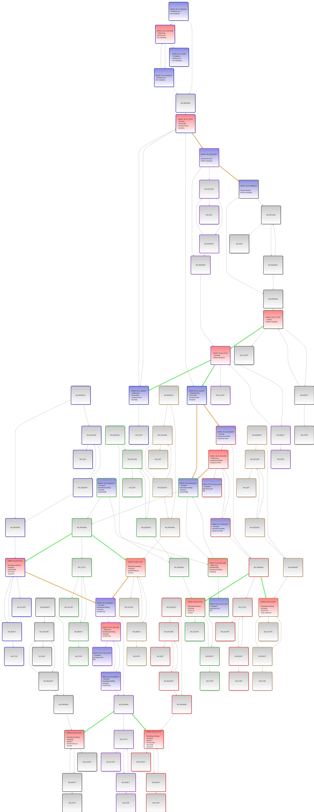

Notes when splitting the VISI transaction into DEMO transactions:

-   "DEMO_TR_02_Change_executed" is not in the scenario because
    otherwise a message would appear twice in the scenario
    ("DEMO_TR_01_ACCEPT - DEMO_TR_02_REQUEST - Approval: (financial)
    consequences of change/start of implementation\")

-   The message "DEMO_TR_03_04_05_QUIT - Withdraw: change by ON" now
    appears 3 times to complete the DEMO transactions

Comments on making the split DEMO/VISI transactions DEMO compatible:

-   Revoke "DEMO_TR_01_REVOKE REQUEST - Withdraw: change" has been
    removed from the transaction because revokes are automatically
    available

-   "DEMO_TR_01_ACCEPT - DEMO_TR_02_REQUEST - Approval: (financial)
    consequences of change/start of implementation" has been renamed to
    "DEMO_TR_01_ACCEPT - Approval: (financial) consequences of change"

-   In the model of "DEMO_TR_01" you can no longer immediately go from
    request to state, there is now a promise in between - the software
    skips this message because it is set to passive (so the user can
    simply request can go to state)

-   At "DEMO_TR_03_Betaalbaarstelling_totaal_issued" you now have 2
    request messages so that this corresponds to the standard
    transaction pattern in VISI - 1 request as a starting message, 1
    request as a mutable message

-   The problem of double states is more common, for example if you want
    to pay at the pizzeria you can pay with cash or with PIN - these are
    2 different ways where different information is required from the
    payer. No information for cash, for PIN the payer needs a PIN code.

-   By splitting the transactions you have to set conditions on
    subtransactions that you can only start once. From the VISI
    transaction, some messages can only be sent once because this is
    included in the flow of the transaction, but you can start
    subtransactions as often as you want. So, for example, you must only
    be able to start a payment request for the total amount once.
