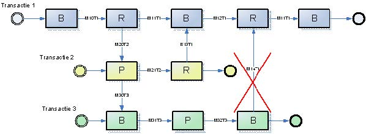
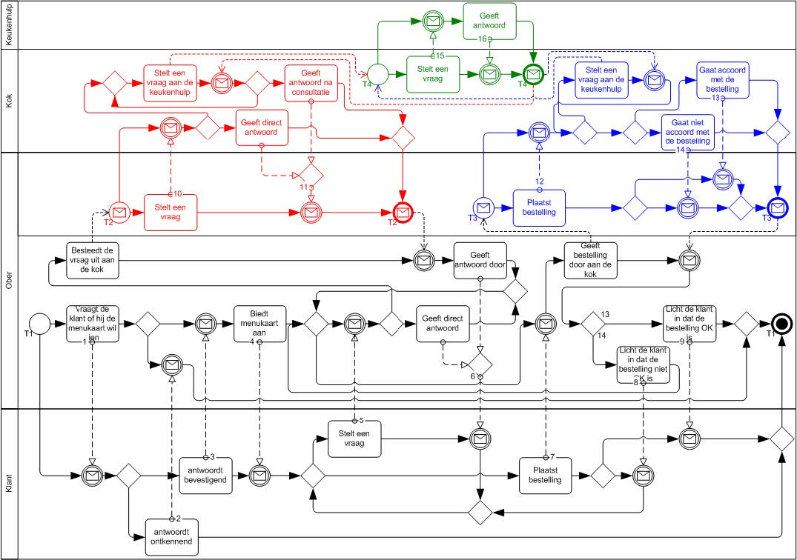

## FAQ

Hieronder volgt een aantal van de -- voor implementatie van VISI --
belangrijkste, veel gestelde vragen ('frequently asked questions'). De
volledige (en meest recente) lijst van FAQ's is te raadplegen op de VISI
website.

### Wat is het eerste MessageType in een TransactionType?

Het eerste MessageType is het MessageType dat binnen een TransactionType
geen voorgaand bericht heeft.

### Wat is het laatste MessageType in een TransactionType?

Het laatste MessageType binnen een transactionType is het MessageType
waaraan niet door andere MessageTypes wordt gerefereerd.

### Indien een bericht verstuurd is in een transacties, is het dan toegestaan om nog een bericht te versturen?

Binnen een transactie is altijd één rol aan zet. Het is wel mogelijk
berichten uit een andere transactie te versturen (ook als transacties
aan elkaar gerelateerd zijn). Dus als een bericht wordt verzonden in een
secundaire transactie maar er is ook nog een MITT in de hoofdtransactie
die op basis van een voorgaande MITT verzonden mag worden, dan is dit
gewoon mogelijk.

### Hoe wordt met het DATETIME datatype omgegaan op het moment dat geen tijdzone is gespecificeerd?

Het DATETIME datatype refereert aan de \"xsd:dateTime\" definitie
(Instant of time (Gregorian calendar)). We passen echter één afwijking
hierop toe: Als geen tijdzone is gespecificeerd wordt UTC (=Z of +00:00)
verondersteld. UTC is bijna gelijk aan Greenwich Mean Time (GMT). GMT is
echter een zuiver astronomische tijd. Om het door de vertraagde
aardrotatie veroorzaakte verschil te compenseren, moeten er
schrikkelsecondes worden gebruikt. Het verschil is nooit meer dan een
seconde en voor de meeste toepassingen dan ook niet van belang.

-   The DATETIME datatype describes instances identified by the
    combination of a date and a time. Its value space is described as a
    combination of date and time of day in Chapter 5.4 of ISO 8601. Its
    lexical space is the extended format:
    '\[-\]CCYY-MM-DDThh:mm:ss\[Z\|(+\|-)hh:mm\]'

-   The time zone may be specified as Z (UTC) or (+\|-)hh:mm. Time zones
    that aren't specified are considered undetermined.

-   Example: Valid values for xsd:dateTime include: 2001-10-26T21:32:52,
    2001-10-26T21:32:52+02:00, 2001-10-26T19:32:52Z,
    2001-10-26T19:32:52+00:00, -2001-10-26T21:32:52, or 2001-10-
    26T21:32:52.12679.

The following values are invalid: 2001-10-26 (all the parts must be
specified), 2001-10- 26T21:32 (all the parts must be specified),
2001-10-26T25:32:52+02:00 (the hours part---25---is out of range), or
01-10-26T21:32 (all the parts must be specified).

### Als ik een raamwerk heb gepromoot en een berichtenschema gegenereerd, heb ik dan de garantie dat dit raamwerk in de praktijk werkt?

Het promoten van een raamwerk garandeert alleen dat het raamwerk aan de
systematiek voldoet en ingelezen kan worden in een VISI compatible
software. Dit garandeert niet dat een raamwerk in de praktijk bruikbaar
is. Als de raamwerkbouwer bijvoorbeeld geen complex element heeft
toegevoegd aan een bericht, dan kan dit in de praktijk in het algemeen
geen gewenste situatie opleveren. Dit neemt niet weg dat het raamwerk
volgens de systematiek valide is.

### Als ik transacties aan elkaar relateer is de traceerbaarheid van communicatie altijd gegarandeerd?

Zolang de VISI filosofie wordt gevolgd, waarin transacties altijd tussen
twee rollen (initiator en executor) verlopen en de initiator altijd een
bericht terug krijgt van de executor, blijft de com- municatie
traceerbaar. In uitzonderlijke situaties is het echter mogelijk om
raamwerken zo op te zetten dat de traceerbaarheid in gevaar kan komen.
Om dergelijke situaties te voorkomen wordt hieronder een voorbeeld
gegeven van een dergelijke uitzondering en vervolgens wordt
geillustreerd hoe het volgens de VISI filosofie hoort te zijn. Indien
meer van dit soort situaties worden gesignaleerd, dan zullen deze worden
toegevoegd aan deze FAQ.\
\
De VISI systematiek gaat ervan uit dat een transactie altijd tussen twee
rollen plaatsvindt. Bij het opstellen van een raamwerk waar de
communicatie over meerdere transacties verloopt dient hier rekening mee
gehouden te worden. Daarnaast hoort een proces dat over bijvoorbeeld
drie transacties verloopt ook weer over dezelfde transacties terug te
verlopen (belangrijk om communicatie ook in een later stadium
traceerbaar te houden). Het onderstaande voorbeeld is fout, het is niet
verstandig een raamwerk op een dergelijke wijze op te zetten.

[//]: # {#fig: width="20%"}

De opzet hieronder is juist, de communicatie blijft traceerbaar.

[//]: # {#fig: width="20%"}

Let bij het interpreteren van de schema's op het volgende. De cirkeltjes
aan het begin en het eind geven respectievelijk het begin en het einde
van een transactie aan. De blokjes zijn rollen en de letters in de
blokjes staan voor een specifieke rol. De codes in de pijlen staan voor
MessageTypes. Voor de duidelijkheid is ook de transactie waar de
MessageType toe behoort in de code verwerkt. M31T3 staat dus voor
MessageType 31 uit transactie 3.

### 7. Hoe geeft ik in een raamwerk aan of een bericht een startbericht is, of niet?

Sinds VISI Standaard versie 1.2 kan in een raamwerk een transactie in
cascadevorm aan een andere transactie worden gekoppeld. Deze koppeling
vindt plaats op berichtniveau. Het startbericht van een subtransactie
heeft het bericht uit de hoofdtransactie dan als voorgaande
(='previous'). Bovenstaande definitie conflicteert echter met de
ongeschreven regel dat een bericht zonder voorgaand bericht
(='previous') een startbericht van een transactie is. Welk bericht het
startbericht van een subtransactie is, is niet eenduidig vastgelegd en
is voor bepaalde raamwerken niet te achterhalen.\
\
In de praktijk is gebleken dat dit bijvoorbeeld onduidelijke situaties
oplevert indien een transactie een subtransactie is van meer dan 1
transactie en op een enkel punt naar 2 of meer hoofdtransacties kan
terugkeren. De groengekleurde transactie in figuur 6 hieronder voldoet
aan deze voorwaarden.

[//]: # {#fig: width="20%"}

Indien in de bovenstaande figuur de communicatie vanaf T1 (zwart) via T2
(rood) naar T4 (groen) is gelopen, en het laatste bericht van T4 (groen)
verstuurd is, is er de keuze om terug te gaan naar T2 (rood) of vooruit
te gaan en een nieuwe subtransactie T3 (blauw) te starten. In dit
voorbeeld is het voor een mens visueel duidelijk te zien dat dit in dit
geval niet de bedoeling is, maar voor software is dit niet mogelijk.\
\
Om dit aan software wel duidelijk te maken, moet er een toevoeging in
het raamwerk komen om aan te geven dat bepaalde berichten wel of niet
een startbericht zijn. In het raamwerk moet dan komen te staan dat T3
(blauw) alleen kan worden gestart vanaf T1 (zwart) en NIET vanaf T4
(groen).\
\
Daartoe zijn de 'Referenties' van de entiteit 'MessageInTransactionType'
in de VISI Systematiek Deel 1 (voorheen Systematiek I) uitgebreid met de
eigenschap 'firstMessage'. Daarmee kan worden aangegeven of een
MessageInTransaction een startbericht betreft.

    ENTITY MessageInTransactionType;
        requiredNotify : INTEGER;
        dateLamu : DATETIME;
        userLamu : STRING;
        received : BOOLEAN;
        send : BOOLEAN;
        state : STRING;
        initiatorToExecutor : OPTIONAL BOOLEAN;
        openSecondaryTransactionsAllowed : OPTIONAL BOOLEAN;
        firstMessage : OPTIONAL BOOLEAN; // <--
        message : MessageType;
        previous : OPTIONAL SET [0:?] O F MessageInTransactionType;
        transaction : TransactionType;
        VISI Pagina 46 van 46
        transactionPhase : OPTIONAL TransactionPhaseType;
        group : GroupType;
    END_ENTITY;

Deze nieuwe eigenschap is een optionele Boolean ('True', of 'False').
Indien deze Boolean afwezig is, geldt de standaard waarde 'False' en kan
er met de betreffende MessageInTransactionType GEEN nieuwe transactie
worden gestart.\
\
Wanneer deze Boolean aanwezig is en de waarde 'True' heeft, kan er met
de MessageInTransactionType wel een nieuwe transactie worden gestart. In
het voorbeeld hierboven dient voor de startberichten van T1, T2, T3 en
T4 deze Boolean dus de waarde 'True' te hebben.\
\
Mocht dit per ongeluk niet zijn ingesteld voor T1 dan mag T1 toch worden
gestart, omdat het startbericht van T1 geen 'previous' heeft. Deze
voorwaarde prevaleert altijd t.o.v. de Boolean.
